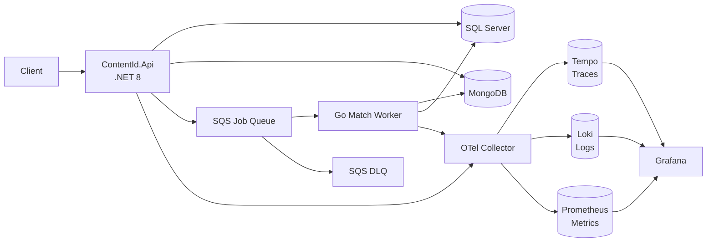
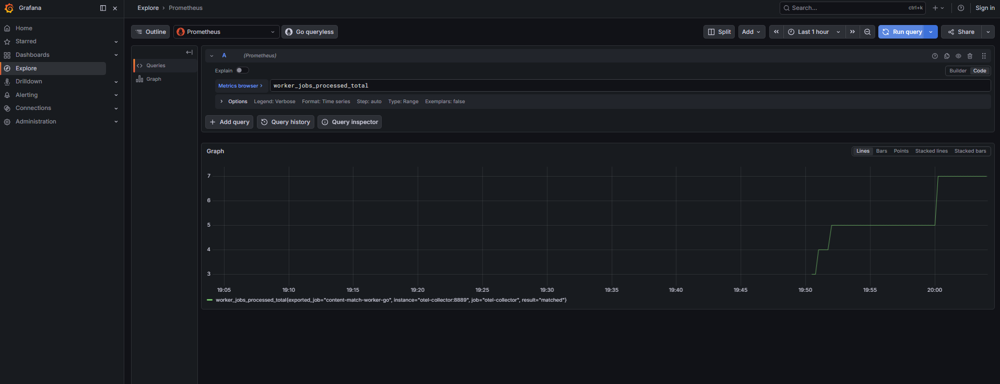
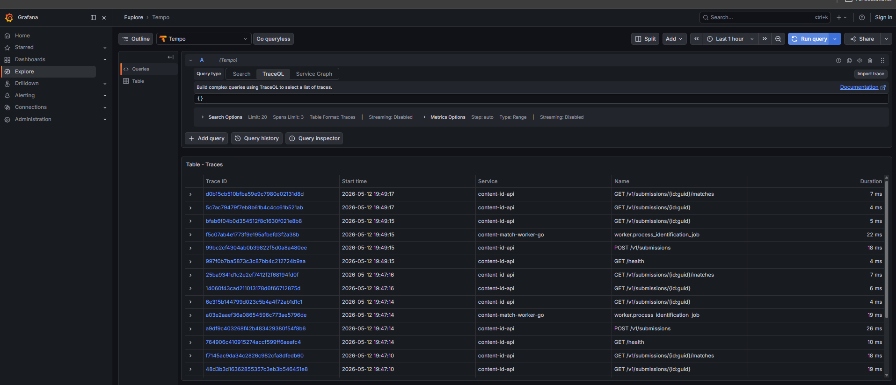
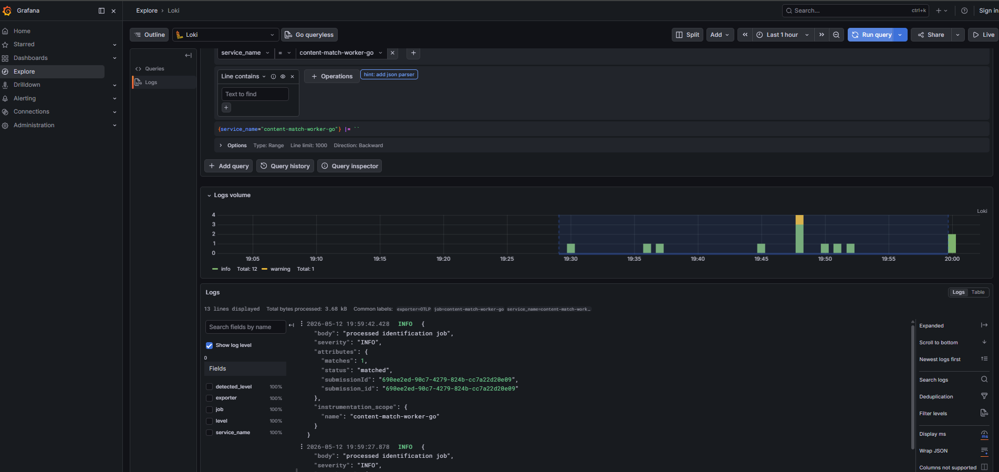

# Content ID Platform

A simplified content identification platform inspired by high-volume automatic content recognition (ACR) systems. A client submits media metadata and a fingerprint hash; the .NET API persists it and enqueues a job; a Go worker consumes the job, runs fingerprint matching against a reference catalog, and writes results back.

## Architecture



## Screenshots

### Swagger API


### Match Result


### Grafana — Prometheus Metrics



### Grafana — Tempo Traces



### Grafana — Loki Logs



## Local Quickstart

```bash
docker compose up --build
```

In another terminal, run the end-to-end validation:

```bash
python3 scripts/healthcheck.py
```

Submit a known matching fingerprint manually:

```bash
curl -s -X POST http://localhost:18080/v1/submissions \
  -H "Content-Type: application/json" \
  -d '{
    "title": "Interview Demo Track",
    "sourcePlatform": "PartnerUpload",
    "contentType": "audio",
    "durationSeconds": 191,
    "fingerprintHash": "abc123"
  }'
```

## Endpoints

| Endpoint | Description |
|---|---|
| `POST /v1/submissions` | Submit a fingerprint for identification |
| `GET /v1/submissions/{id}` | Get submission status |
| `GET /v1/submissions/{id}/matches` | Get match results |
| `GET /health` | Dependency health check (SQL Server, MongoDB, asset catalog) |
| `GET /metrics` | Prometheus metrics stub |

## Observability

All services export OpenTelemetry signals to the OTel Collector, which fans out to:

| Signal | Backend | Grafana query |
|---|---|---|
| Traces | Tempo | `{}` in Explore → Tempo |
| Logs | Loki | `{service_name="content-id-api"}` or `content-match-worker-go` |
| Metrics | Prometheus | `worker_jobs_processed_total`, `contentid_submissions_created_total` |

**Grafana UI**: http://localhost:13000 (no login required)

Key metrics:
- `worker_jobs_processed_total{result="matched|no_match|error"}` — worker throughput by outcome
- `contentid_submissions_created_total` — API intake rate
- `http_server_request_duration_seconds` — ASP.NET Core HTTP latency

## Port Map

| Service | External port | Notes |
|---|---|---|
| ContentId.Api | 18080 | Swagger at `/swagger` |
| SQL Server | 11433 | |
| MongoDB | 27018 | |
| LocalStack | 4566 | SQS, SNS, S3 |
| OTel Collector gRPC | 14317 | |
| OTel Collector HTTP | 14318 | |
| Grafana | 13000 | |

## What This Demonstrates

- **C#/.NET 8** minimal API for submission intake and result retrieval with OpenAPI
- **Go worker** for async content matching via shared-prefix fingerprint similarity
- **SQS + DLQ** for retryable background processing (up to 3× retry, then dead-letter)
- **SQL Server** for normalized job state (`submissions`, `match_results` with MERGE upsert)
- **MongoDB** for flexible fingerprint and raw match documents
- **LocalStack** for local AWS SQS, SNS, and S3 without cloud costs
- **OpenTelemetry** traces, logs, and metrics from both services via OTLP gRPC
- **Grafana + Tempo + Loki + Prometheus** full observability stack
- **OpenTofu** AWS infrastructure definitions in `infra/opentofu`
- **Python** end-to-end healthcheck automation in `scripts/healthcheck.py`

## Docs

- [Architecture](docs/architecture.md)
- [Runbook](docs/runbook.md)
- [JD Mapping](docs/jd-mapping.md)
- [Interview Talking Points](docs/interview-talking-points.md)
