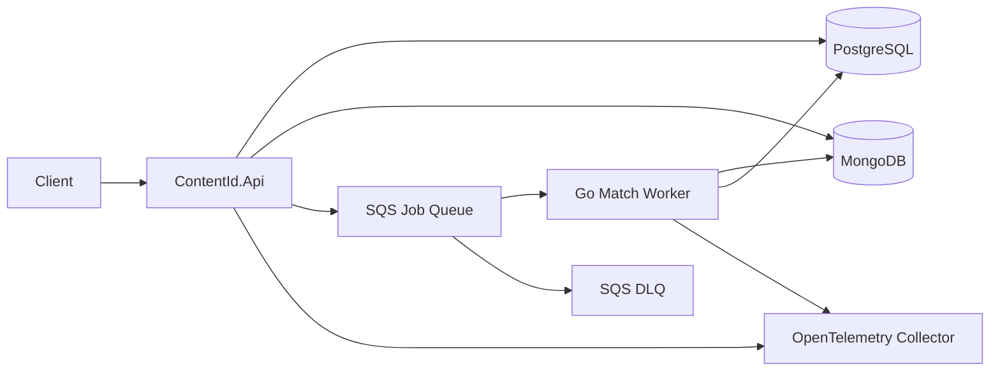
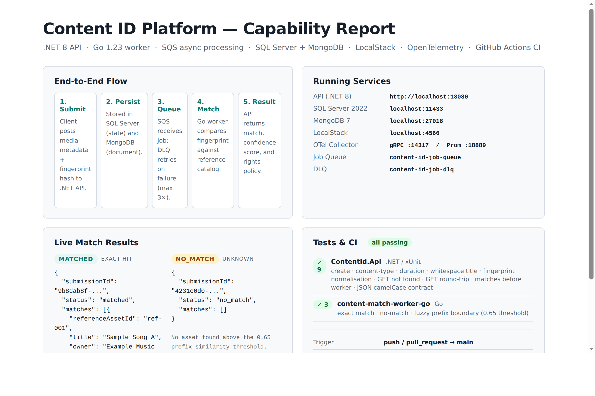
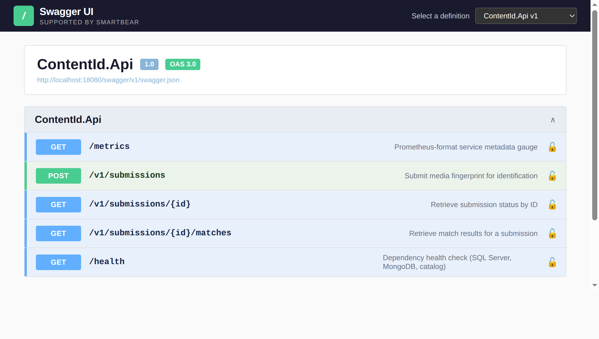
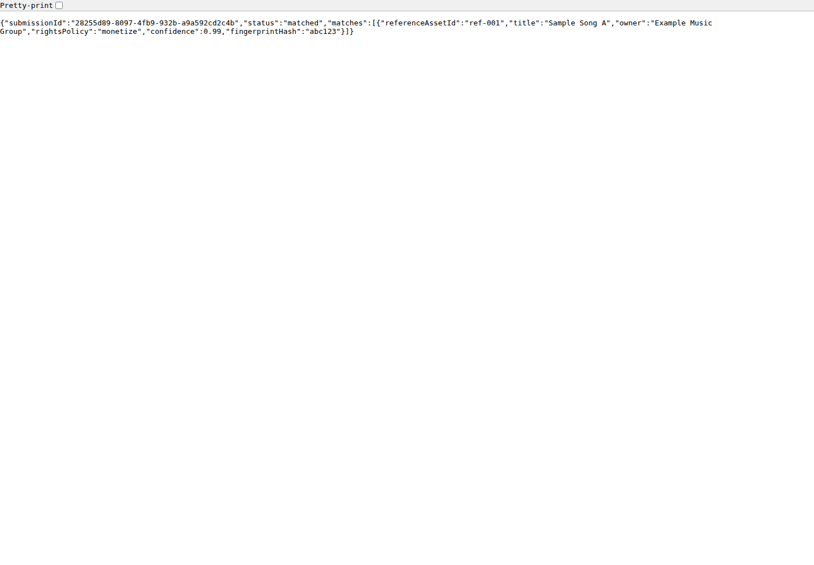

# Content ID Platform

A simplified content identification platform inspired by high-volume automatic content recognition systems. The project demonstrates a .NET API, Go match worker, asynchronous queue processing, PostgreSQL, MongoDB, LocalStack-backed AWS resources, OpenTelemetry, OpenTofu-style infrastructure, and Python automation.

## Architecture



## Screenshots

### Capability Report



### API Surface



### Match Result



## Local Quickstart

```bash
docker compose up --build
```

In another terminal:

```bash
./scripts/healthcheck.py
```

Submit a known matching fingerprint:

```bash
curl -s -X POST http://localhost:18080/v1/submissions \
  -H "Content-Type: application/json" \
  -d '{
    "title": "Interview Demo Track",
    "sourcePlatform": "PartnerUpload",
    "contentType": "audio",
    "durationSeconds": 191,
    "fingerprintHash": "abc123"
  }'
```

Useful endpoints:

- `POST /v1/submissions`
- `GET /v1/submissions/{id}`
- `GET /v1/submissions/{id}/matches`
- `GET /health`
- `GET /metrics`

## What This Demonstrates

- C#/.NET platform API for submission intake and result retrieval.
- Go worker for asynchronous content matching.
- SQS queue plus DLQ for retryable background processing.
- PostgreSQL for normalized job state and match summaries.
- MongoDB for flexible fingerprint and raw match documents.
- LocalStack for local AWS SQS, SNS, and S3 resources.
- OpenTelemetry traces from API and worker.
- OpenTofu/Terraform-style AWS infrastructure in `infra/opentofu`.
- Python automation in `scripts/healthcheck.py`.

## JD Alignment

This repo maps directly to backend/platform responsibilities in the target role: scalable APIs, async processing, C#/.NET, Go, MongoDB, PostgreSQL, AWS messaging, Docker Compose, IaC, observability, Python scripting, production runbooks, and clear developer documentation.

See:

- [Architecture](docs/architecture.md)
- [Runbook](docs/runbook.md)
- [JD Mapping](docs/jd-mapping.md)
- [Interview Talking Points](docs/interview-talking-points.md)
